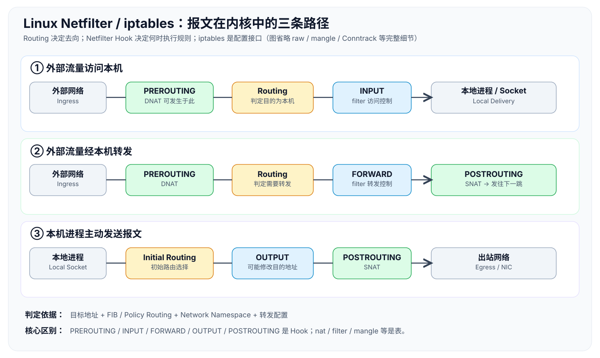

# Netfilter / iptables：内核报文路径与规则执行



> [查看 ChatGPT 分享的原版流程图](https://chatgpt.com/s/m_6ac9a4ecac388191b3fdd4c53c57940c)（原版 PNG 未托管在 GitHub；上方为可直接预览的矢量重绘图）。

## 一句话

**Netfilter 是 Linux 网络协议栈中的 Hook 框架；iptables 是配置 Xtables/nf_tables 规则的用户空间入口；Routing 决定报文去哪里，filter 决定是否放行，Conntrack/NAT 维持连接级状态。**

## 原理

### 1. 三条经典 IPv4 数据路径

```text
入站本机：NIC → PREROUTING → Route(local)   → INPUT → Socket
转发报文：NIC → PREROUTING → Route(forward) → FORWARD → POSTROUTING → NIC
本机发包：Socket → 初始 Route → OUTPUT → POSTROUTING → NIC
```

- **Route 决策不是 iptables Chain**：IP 层根据目的地址、FIB、策略路由及对应网络上下文选择 local delivery、forward 或丢弃。DNAT 在 PREROUTING 修改目标地址后，路由使用转换后的目的地址；本机 OUTPUT 修改目的地址可能触发重新路由。
- **Hook 不是 Table**：PREROUTING 等是执行时机，同一 Hook 可以运行多个优先级不同的处理模块。表是规则的逻辑分组，链是规则执行序列，Target 是匹配后的操作。
- **FORWARD ≠ OUTPUT**：前者属于路由转发的报文，后者处理本机生成的报文；本机响应经 OUTPUT，而非 FORWARD。

### 2. 核心表、链与优先级

| 表 | 目的 | 常见位置 / 处理 |
|---|---|---|
| raw | 连接跟踪前的规则，例如 NOTRACK | PREROUTING、OUTPUT，典型 priority -300 |
| mangle | 报文属性和标记 | 多个 Hook，常见 priority -150 |
| nat | DNAT、SNAT、MASQUERADE | PREROUTING、OUTPUT、POSTROUTING 等，依操作而定 |
| filter | 常规报文访问控制 | INPUT、FORWARD、OUTPUT，典型 priority 0 |
| security | SELinux 等安全标记 | INPUT、FORWARD、OUTPUT，典型 priority 50 |

**优先级越小越早执行**；以上是典型配置，并非每个 Hook 都运行全部表。IPv4 经典路径还涉及 defrag、Conntrack、路由以及协议栈其他模块。

### 3. 内核从 skb 到 Verdict 的执行模型

```text
NIC / 协议栈 → struct sk_buff (skb)
    → nf_hook() 找到当前 netns / 协议族 / Hook 的回调集合
    → nf_hook_slow() 按优先级调用注册 Hook
    → Xtables 解释器 ipt_do_table()（仅 iptables-legacy）
    → 规则 Match → Target / 跳链 / RETURN → Verdict
    → 继续协议栈或 DROP / QUEUE
```

**两个不同的循环**：(1) Netfilter 在同一 Hook 上遍历回调；(2) iptables 规则解释器在某个 Chain 内遍历规则。Chain 中的 ACCEPT 只表示当前规则判断放行，不能保证绕过后续 Hook/安全检查。简单线性规则链最坏匹配复杂度通常为 O(n)；集合查找（ipset/nft sets）可改善大规模成员匹配。

```c
// 教学伪代码：省略 RCU、对象生命周期及异常分支
for (hook : hook_list_sorted_by_priority) {
    verdict = hook(skb, state);
    if (verdict == DROP) { discard(skb); break; }
    if (verdict == ACCEPT) continue;
}
```

### 4. Conntrack ≠ TCP 状态机

连接跟踪在 `nf_conn` 中关联 original/reply 两个方向的 tuple、协议相关状态、超时和 NAT 映射：

```text
(tuple, netns, zone) → conntrack entry → ctstate
```

| Conntrack State | 含义 |
|---|---|
| NEW | 尚未识别为已建立双向通信的连接相关报文 |
| ESTABLISHED | 属于已观察到双向通信的连接 |
| RELATED | 与已有连接相关的报文/新流 |
| INVALID | 无法有效跟踪 |
| UNTRACKED | 被配置为不进行连接跟踪 |

`ESTABLISHED` 不等于 TCP 状态机的 ESTABLISHED；UDP 连接跟踪同样可出现此分类。

### 5. NAT 与路由的先后关系

```text
入站 DNAT：PREROUTING (dst 修改) → 路由 → FORWARD 或 INPUT
出站 SNAT：路由 → FORWARD 或 OUTPUT → POSTROUTING (src 修改)
```

- 有状态 NAT 一般在连接开始时匹配 NAT 规则以建立映射，之后的报文依赖 Conntrack/NAT 状态继续执行地址转换，而非重新选择规则。
- FORWARD 通常看到的是 **DNAT 后的目的地址**，审计时不能把原始五元组和当前报文五元组混为一谈。
- 容器端口映射还要同时检查宿主 netns、DNAT、FORWARD、路由、veth 和出站策略。

### 6. 与 Network Namespace 的关系

```text
task_struct → nsproxy → struct net
                              ├── Hook 列表
                              ├── 路由表/设备视图
                              └── Conntrack 等网络上下文
```

Hook 可按 `(netns, protocol family, hook number)` 定位；Socket 也可能携带自身绑定的 netns（`sock_net(sk)`），不总是重新读取当前进程的 netns。不同容器可以有独立规则，但容器报文仍可能进入宿主 netns 的路由和 Netfilter 处理路径。

## 安全审计

```bash
iptables -V                 # 判定 legacy 或 nf_tables 后端
sudo iptables-save          # 导出规则/默认策略
sudo nft -a list ruleset    # 检查 nftables 规则及 handle
sudo conntrack -L          # 查看连接跟踪状态（需安装工具）
sudo lsns -t net           # 枚举 Network Namespace
readlink /proc/<PID>/ns/net
```

- **先辨识后端**：iptables-nft 命令不是由传统 `ipt_do_table()` 执行，勿把两套源码混用。
- **追踪完整路径**：报文入口 → Netfilter Hook 优先级 → Conntrack → DNAT → FIB Route → INPUT/FORWARD → SNAT → 出站。
- **审计默认策略**、规则顺序、早期 ACCEPT/RETURN、放行 ESTABLISHED/RELATED、DNAT 前后地址、转发开关、Host 与 Container Namespace。
- **性能与观测**：XDP、Flowtable Offload 等机制可能让部分报文绕过经典规则路径，不能仅根据规则计数器为 0 认定没有流量。

## 易错

- **Netfilter ≠ iptables**：前者是内核框架，后者是配置入口。
- **Table ≠ Hook**：`nat/PREROUTING` 表示 nat 表的 PREROUTING 链；PREROUTING 本身是 Hook。
- **Routing ≠ Filtering**：路由选择处理方向，过滤决定规则策略结果。
- **ACCEPT ≠ 永久放行**：后续回调、Hook 和其他内核检查仍可拒绝。
- **Conntrack NEW ≠ 只能是 TCP SYN**；Conntrack ESTABLISHED ≠ TCP ESTABLISHED。
- **NAT 规则通常只决策新映射；NAT 地址转换仍发生于后续报文**。
- **Namespace ≠ 强制安全边界**，容器间共享内核，需结合 capabilities/seccomp/LSM。

## 继续深入源码

- `net/netfilter/core.c`：`nf_hook_slow()`、Hook 执行
- `net/ipv4/netfilter/ip_tables.c`：`ipt_do_table()`（legacy）
- `net/netfilter/nf_conntrack_core.c`：连接跟踪
- `net/netfilter/nf_nat_core.c`：NAT 状态与操作
- `net/ipv4/ip_input.c`、`ip_forward.c`、`ip_output.c`、`route.c`：IPv4 数据路径

> 以上内核调用关系为教学简化模型；细节和路径以目标 Linux 内核版本和 iptables 后端为准。
